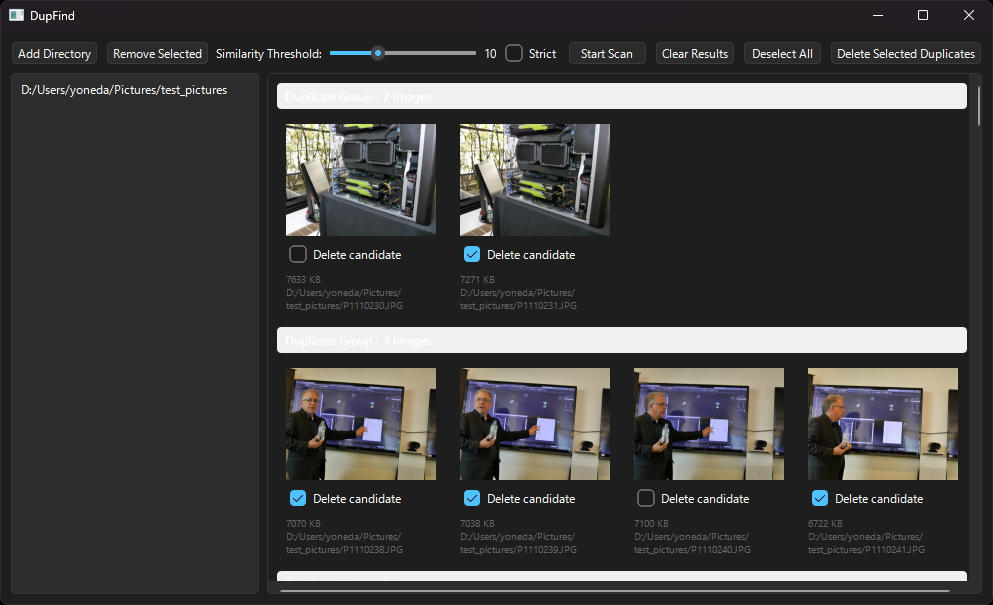

# DupFind - 類似画像ファイル検索・整理ツール

ストレージにある類似した画像ファイルを検索するツールです。Antigravityを利用して初めてバイブコーディングで開発してみました。コードをほとんど書かずに何かを作ったのは初めてですが、それなりに活用できそうなツールができたので公開しておきます。

過去の撮影した写真や利用した画像ファイル類を整理したいということは多いと思います。画像の内容で検索するツールはいくつかありますが、本DupFindはシンプルなpHash/dHashを用いることで、高速に類似画像を検索します。また、GUIとCLIを併用することで、効率の良い整理作業ができることが特徴です。

なお、画像の近似判定にpopcnt命令が必要なので、x86ではSSE4.2に対応したCPUが必要です。古いCPUでは動作しない可能性がありますが、SSE4.2に対応していないCPU（Nehalem/初代Coreプロセッサより古いCPU）が現役であるとは考えにくいので、ほとんど問題が起きることはないでしょう。

## 特徴

- pHash/dHashによる高速な類似画像検索
- CLIを使ってバックグラウンドでの画像ハッシュ計算に対応
- マルチプラットフォーム（WindowsとLinuxで動作を確認）

## 使い方

書き込み権限があるディレクトリに、実行ファイルとWindowsではDLLなど一式を配置します。配置したディレクトリに設定ファイルDupFind.iniとキャッシュファイルdupfind_cache.dbが自動生成されるので、書き込み権限が必ず必要です。その点は注意してください。

DupFindがGUI、DupFindCmdがCLIです。

### DupFind

GUIのDupFindを起動すると次のようなウィンドウが表示されます。



#### Add Directory

検索するディレクトリを追加します。追加したディレクトリはリストに表示されます。ディレクトリは複数指定可能です。

#### Remove Directory

リストで選択したディレクトリを検索対象から外します。リストから削除しても、キャッシュ内の情報は保持されます。

#### Similarity Threshold

検索する際の類似度の閾値を設定します。値が小さいほど類似度が高くなります。デフォルトは5です。

#### Strict Mode

Strictにチェックを入れると、厳密モードで検索します。通常はチェックを入れなくても良いでしょう。

#### Start Scan

検索を開始します。検索中はGUIがフリーズしますが、バックグラウンドで画像ハッシュの計算を行っています。検索が完了すると、結果が表示されます。グループ表示されている類似画像のチェックボックスは、削除候補です。チェックを入れた画像が削除対象になります。デフォルトではファイルサイズが小さいものが削除候補になります。必要に応じてチェックを外してください。

サムネイルをダブルクリックすると、OSで関連付けられているビューアーが起動し、画像を表示します。また、サムネイルを右クリックするとメニューが表示され、「Copy Full Path」で画像のフルパスをクリップボードにコピーでき、「Remove from List」でリストから削除できます。

#### Clear Results

検索結果をクリアします。キャッシュは削除されません。

#### Deselect All

チェックボックスをすべて外します。

#### Delete Selected

チェックを入れた画像を削除します。削除した画像は、OSのゴミ箱に移動します。

### DupFindCmd

DupFindCmdは、ヘルパーコマンドです。CLIで利用します。コマンドパラメータは次の通り。

```console
DupFindCmd add directory_path
DupFindCmd th N
DupFindCmd strict on|off
DupFindCmd search image_file
```

#### add directory_path

指定したdirectory_pathを検索対象に追加し、バックグラウンドで情報をキャッシュに格納します。GUIのStart Scanと同じ動作ですが、バックグラウンドで実行され結果は表示されません。大量の画像があるディレクトリを、あらかじめaddコマンドでキャッシュしておくことで、GUIのStart Scanの実行時間を短縮できます。

#### th N

類似度の閾値をNに設定します。Nには0から32の間の値を指定してください。デフォルトは5です。

#### strict on|off

Strictモードをオンまたはオフに設定します。デフォルトはオフです。

#### search image_file

指定したimage_fileと類似する画像をキャッシュ内から検索します。検索時に使われる閾値とStrictモードは現在の設定が使われます。結果は標準出力に出力されます。image_fileの情報はキャッシュされません。

## ビルド方法

### Linux

ビルドにはOpenCV、Qt6、SQLite3が必要です。これらのライブラリ及びヘッダファイル群をインストールしてから、次のコマンドを実行してください。Debian/Ubuntuの場合は次のようにインストールします。

```console
sudo apt update
sudo apt install build-essential cmake
sudo apt install qt6-base-dev qt6-declarative-dev libqt6concurrent6
sudo apt install qt6-l10n-tools qt6-tools-dev qt6-tools-dev-tools
sudo apt install libopencv-dev
sudo apt install libsqlite3-dev
sudo apt install libprotobuf-dev
```

ソースコードを適当なディレクトリに配置後、そのディレクトリに移動して次のコマンドを実行します。

```console
cmake -B build
cmake --build build
```

### Windows

Windows上でのビルドにはVisual Stduio 2026を利用しました。vcpkgなどを使ってOpenCV、Qt6、SQLite3をインストールしてください。OpenCVやQtはvcpkgを使うより公式のインストーラーを利用したほうが楽かもしれません。SQLite3はvcpkgで簡単にインストールできるはずです。

Visual Studio 2026でCMakeプロジェクトとして開いてビルドします。CMakeを利用する場合は、環境に合わせてCMakePresets.jsonを作成してください。ソースコードに添付しているCMakePresets.jsonはあくまでサンプルです。

### その他

OSに依存していないので、OpenCV、SQLite3、Qt6がインストールされていれば、macOSやその他のOSでビルドできるはずです。

## 謝辞

DupFindの開発には以下のライブラリを利用しました。感謝いたします。

- OpenCV
- Qt 6
- SQLite3

---

# English

# DupFind - Similar Image File Search & Organization Tool

A tool to search for similar image files in your storage. I developed this using Antigravity through "vibe coding" for the first time. It's my first time building something with almost no code written manually, but it turned out to be a quite useful tool, so I am publishing it.

Many people probably want to organize their past photos and image files. Although there are several tools that can search based on image content, DupFind searches for similar images quickly using a simple pHash/dHash. It features efficient organization workflows by combining GUI and CLI tools.

Note: Since the image similarity judgment requires the `popcnt` instruction, an x86 CPU supporting SSE4.2 is required. It might not work on very old CPUs, but since it is highly unlikely that CPUs lacking SSE4.2 support (older than Nehalem / 1st Gen Core processors) are still in active use, this should rarely be an issue.

## Features

- High-speed similar image search using pHash/dHash
- CLI support for calculating image hashes in the background
- Multi-platform (Confirmed to work on Windows and Linux)

## Usage

Place the executable along with the necessary DLLs (on Windows) in a directory where you have write permissions. Please be aware that you absolutely need write permissions because the configuration file `DupFind.ini` and the cache file `dupfind_cache.db` will be auto-generated in this directory.

`DupFind` is the GUI, and `DupFindCmd` is the CLI.

### DupFind (GUI)

When you launch the DupFind GUI, the following window will be displayed:


#### Add Directory

Add a directory to search. The added directories will be shown in the list. You can specify multiple directories.

#### Remove Directory

Remove the selected directory from the search targets. Even if removed from the list, the information within the cache is retained.

#### Similarity Threshold

Set the threshold for similarity when searching. A smaller value indicates higher similarity. The default is 5.

#### Strict Mode

Checking "Strict" will search in strict mode. Usually, you don't need to check this.

#### Start Scan

Starts the search. The GUI will freeze during the search, but it is calculating image hashes in the background. Once the search is complete, the results are displayed. The checkboxes on the grouped similar images indicate candidates for deletion. The checked images will be targeted for deletion. By default, smaller file sizes are marked as deletion candidates. Please uncheck them as necessary.

Double-clicking a thumbnail opens the image in your OS's default viewer. Right-clicking a thumbnail opens a menu where you can copy the full path of the image to the clipboard using "Copy Full Path", or remove the item from the list using "Remove from List".

#### Clear Results

Clears the search results from the UI. The cache is not deleted.

#### Deselect All

Unchecks all checkboxes.

#### Delete Selected

Deletes the checked images. Deleted images are moved to the OS Trash/Recycle Bin.

### DupFindCmd (CLI)

`DupFindCmd` is a helper command used from the CLI. The command parameters are as follows:

```console
DupFindCmd add directory_path
DupFindCmd th N
DupFindCmd strict on|off
DupFindCmd search image_file
```

#### add directory_path

Adds the specified `directory_path` to the search targets and stores its information in the cache in the background. It performs the same operation as the GUI's "Start Scan" but runs in the background without displaying results. By caching directories with a large number of images using the `add` command beforehand, you can shorten the execution time of "Start Scan" in the GUI.

#### th N

Sets the similarity threshold to `N`. Please specify a value between 0 and 32 for `N`. The default is 5.

#### strict on|off

Turns strict mode on or off. The default is off.

#### search image_file

Searches the cache for images similar to the specified `image_file`. The threshold and strict mode used during the search rely on the current settings. The results are output to standard output. Information about `image_file` itself is not cached.

## Build Instructions

### Linux

Building requires OpenCV, Qt6, and SQLite3. Please install these libraries and their header files, then run the following commands. For Debian/Ubuntu, install them as follows:

```console
sudo apt update
sudo apt install build-essential cmake
sudo apt install qt6-base-dev qt6-declarative-dev libqt6concurrent6
sudo apt install qt6-l10n-tools qt6-tools-dev qt6-tools-dev-tools
sudo apt install libopencv-dev
sudo apt install libsqlite3-dev
sudo apt install libprotobuf-dev
```

After placing the source code in an appropriate directory, navigate to that directory and run the following commands:

```console
cmake -B build
cmake --build build
```

### Windows

Visual Studio 2026 was used to build on Windows. Please install OpenCV, Qt6, and SQLite3 using tools like vcpkg. For OpenCV and Qt, it might be easier to use their official installers instead of vcpkg. SQLite3 should be easily installable via vcpkg.

Open it as a CMake project in Visual Studio 2026 to build. When using CMake, please create a `CMakePresets.json` that matches your environment. The `CMakePresets.json` attached to the source code is just a sample.

### Others

Since it is OS-independent, you should be able to build it on macOS or other operating systems as long as OpenCV, SQLite3, and Qt6 are installed.

## Acknowledgments

The following libraries were used in the development of DupFind. I am grateful for them:

- OpenCV
- Qt 6
- SQLite3
